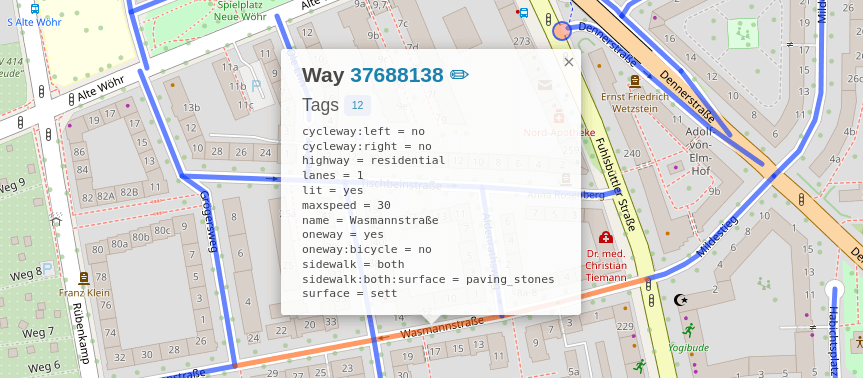

A typed async client for the [taginfo] API, a system for finding and aggregating
information about [OpenStreetMap]'s [tags], and making it browsable and searchable.

This library makes use of [aiohttp] for requests, and [Pydantic] for parsing
and validating the responses.

[taginfo]: https://taginfo.openstreetmap.org
[OpenStreetMap]: https://www.openstreetmap.org
[tags]: https://wiki.openstreetmap.org/wiki/Tags
[aiohttp]: https://docs.aiohttp.org/
[Pydantic]: https://pydantic.dev/

#### Contents
- [Rationale](#rationale)
- [Usage](#usage)
- [Endpoints](#endpoints)

#### See also
- An overview of modules, classes and functions can be found in the [API reference](https://www.timwie.dev/aio-taginfo/)
- The version history is available in [CHANGELOG.md](https://github.com/timwie/aio-taginfo/blob/main/CHANGELOG.md)
- The [taginfo website](https://taginfo.openstreetmap.org/),
  its [API documentation](https://taginfo.openstreetmap.org/taginfo/apidoc),
  its [OSM Wiki page](https://wiki.openstreetmap.org/wiki/Taginfo),
  and its [repository](https://github.com/taginfo/taginfo)

<br>

## Rationale
A tag consists of two items, a key and a value. For instance,
[`highway=residential`](https://wiki.openstreetmap.org/wiki/Tag:highway%3Dresidential)
is a tag with a key of [`highway`](https://wiki.openstreetmap.org/wiki/Key:highway)
and a value of `residential`, which should be used on a
[way](https://wiki.openstreetmap.org/wiki/Way) to indicate a road along which people live.



Now, why is there need for the taginfo API?
> OpenStreetMap uses tags to add meaning to geographic objects. There is no fixed
> list of those tags. New tags can be invented and used as needed. Everybody can
> come up with a new tag and add it to new or existing objects. This makes
> OpenStreetMap enormously flexible, but sometimes also a bit hard to work with.
> 
> Whether you are contributing to OSM or using the OSM data, there are always
> questions like: What tags do people use for feature X? What tags can I use for
> feature Y so that it appears properly on the map? Is the tag Z described on the
> wiki actually in use and where?
> 
> Taginfo helps you by showing statistics about which tags are actually in the
> database, how many people use those tags, where they are used and so on. It also
> gets information about tags from the wiki and from other places. Taginfo tries
> to bring together all information about tags to help you understand how they are
> used and what they mean.


<br>

## Usage
Before using this library, please be aware of the general rules when using the taginfo API:

> Taginfo has an API that lets you access the contents of its databases in several
> ways. The API is used internally for the web user interface and can also be used
> by anybody who wants to integrate taginfo data into their websites or
> applications.

> The API is intended for the use of the OpenStreetMap community. Do not use it
> for other services. If you are not sure, ask on the mailing list (see below).
> 
> Always use a sensible User-agent header with enough information that we can
> contact you if there is a problem.
> 
> The server running the taginfo API does not have unlimited resources. Please use
> the API responsibly. Do not create huge amounts of requests to get the whole
> database or large chunks of it, instead use the [database downloads] provided.
> If you are using the API and you find it is slow, you are probably overusing it.
> 
> If you are using the taginfo API it is recommended that you join the
> [taginfo-dev mailing list]. Updates to the API will be announced there and this
> is also the right place for your questions. 

[database downloads]: https://taginfo.openstreetmap.org/download
[taginfo-dev mailing list]: https://lists.openstreetmap.org/listinfo/taginfo-dev

The data available through taginfo is licenced under [ODbL],
the same license as the OpenStreetMap data.

> OpenStreetMap[®] is open data, licensed under the
> [Open Data Commons Open Database License] (ODbL)
> by the [OpenStreetMap Foundation] (OSMF).
> 
> You are free to copy, distribute, transmit and adapt our data, as long as you
> credit OpenStreetMap and its contributors. If you alter or build upon our data,
> you may distribute the result only under the same licence. The full [legal code]
> explains your rights and responsibilities. 

[ODbL]: https://www.openstreetmap.org/copyright/en
[®]: https://www.openstreetmap.org/copyright/en#trademarks
[Open Data Commons Open Database License]: https://opendatacommons.org/licenses/odbl/
[OpenStreetMap Foundation]: https://osmfoundation.org/
[legal code]: https://opendatacommons.org/licenses/odbl/1.0/

### Example
Here is an example of an API request using this library:

```python
from aio_taginfo import key_overview

# either use a temporary session…
response: Response[KeyOverview] = await key_overview(key="amenity")

# …or provide your own
headers = {"User-Agent": "your contact info"}
async with aiohttp.ClientSession(headers=headers) as session:
    response: Response[KeyOverview] = await key_overview(key="amenity", session=session)
```

Most endpoints will return a [`Response[T]`](https://www.timwie.dev/aio-taginfo/aio_taginfo/api/v4.html#Response),
or `Response[list[T]]` for those returning multiple or paginated items.

<br>

## Endpoints
This library is in early development and most endpoints are still missing.

|   | Endpoint                             | Schema                         |
|--:|--------------------------------------|--------------------------------|
|   | `/api/4/key/chronology`              | `Response[list[T]](page=None)` |
|   | `/api/4/key/combinations`            | `Response[list[T]]`            |
| ✅ | `/api/4/key/distribution/nodes`      | `PngResponse`                  |
|   | `/api/4/key/distribution/ways`       | `PngResponse`                  |
| ✅ | `/api/4/key/overview`                | `Response[T]`                  |
| ✅ | `/api/4/key/prevalent_values`        | `Response[list[T]](page=None)` |
|   | `/api/4/key/projects`                | `Response[list[T]]`            |
| ✅ | `/api/4/key/similar`                 | `Response[list[T]]`            |
|   | `/api/4/key/stats`                   | `Response[list[T]](page=None)` |
|   | `/api/4/key/values`                  | `Response[list[T]]`            |
|   | `/api/4/key/wiki_pages`              | `Response[list[T]](page=None)` |
|   | `/api/4/keys/all`                    | `Response[list[T]]`            |
|   | `/api/4/keys/similar`                | `Response[list[T]]`            |
|   | `/api/4/keys/wiki_pages`             | `Response[list[T]]`            |
|   | `/api/4/keys/without_wiki_page`      | `Response[list[T]]`            |
|   | `/api/4/project/icon`                | `PngResponse`                  |
|   | `/api/4/project/tags`                | `Response[list[T]]`            |
|   | `/api/4/projects/all`                | `Response[list[T]]`            |
|   | `/api/4/projects/keys`               | `Response[list[T]]`            |
|   | `/api/4/projects/tags`               | `Response[list[T]]`            |
|   | `/api/4/relation/projects`           | `Response[list[T]]`            |
|   | `/api/4/relation/roles`              | `Response[list[T]]`            |
|   | `/api/4/relation/stats`              | `Response[list[T]](page=None)` |
|   | `/api/4/relation/wiki_pages`         | `Response[list[T]](page=None)` |
|   | `/api/4/relations/all`               | `Response[list[T]]`            |
|   | `/api/4/search/by_key_and_value`     | `Response[list[T]]`            |
|   | `/api/4/search/by_keyword`           | `Response[list[T]]`            |
|   | `/api/4/search/by_role`              | `Response[list[T]]`            |
|   | `/api/4/search/by_value`             | `Response[list[T]]`            |
| ✅ | `/api/4/site/config/geodistribution` | `T`                            |
|   | `/api/4/site/info`                   | `T`                            |
|   | `/api/4/site/sources`                | `T`                            |
|   | `/api/4/tag/chronology`              | `Response[list[T]](page=None)` |
|   | `/api/4/tag/combinations`            | `Response[list[T]]`            |
|   | `/api/4/tag/distribution/nodes`      | `PngResponse`                  |
|   | `/api/4/tag/distribution/ways`       | `PngResponse`                  |
|   | `/api/4/tag/overview`                | `Response[T]`                  |
|   | `/api/4/tag/projects`                | `Response[list[T]]`            |
|   | `/api/4/tag/stats`                   | `Response[list[T]](page=None)` |
|   | `/api/4/tag/wiki_pages`              | `Response[list[T]](page=None)` |
|   | `/api/4/tags/list`                   | `Response[list[T]](page=None)` |
| ✅ | `/api/4/tags/popular`                | `Response[list[T]]`            |
|   | `/api/4/unicode/characters`          | `Response[list[T]](page=None)` |
|   | `/api/4/wiki/languages`              | `Response[list[T]](page=None)` |
